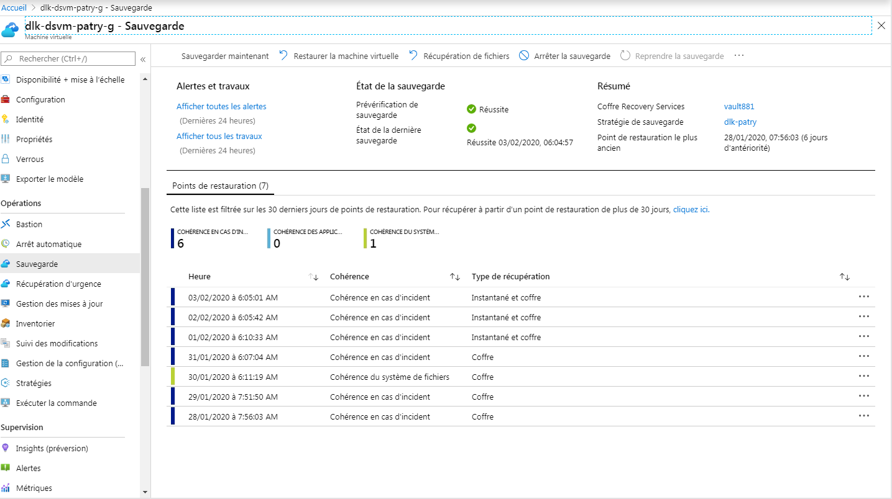

# Backup/Restore using AZ BackUp infrastructure

#### All these commands will require an azure Command-LIne shell. You will need to follow [this](https://docs.microsoft.com/fr-fr/cli/azure/install-azure-cli?view=azure-cli-latest) process guide.

As shown below, the three Patry VMs are saved on `vault881` with a six days retention.

<h2><center> </h2>

Every VMs images and disks has to be saved into a vault. To do so, just type this command :

```bash
az backup vault create --location westeurope --name NameOfTheRecoveryServicesVault --resource-group RG-POC-IDRS-DC
```

You can get the vault list available in our subscription.

```bash
az backup vault list -g RG-POC-IDRS-DC --subscription 8d874d62-1558-407f-8473-58d9aa2e2363
```

The result is down after in JSON.

```bash
[
  {
    "eTag": null,
    "etag": "W/\"datetime'2020-01-27T02%3A18%3A48.4910478Z'\"",
    "id": "/subscriptions/8d874d62-1558-407f-8473-58d9aa2e2363/resourceGroups/RG-POC-IDRS-DC/providers/Microsoft.RecoveryServices/vaults/vault881",
    "location": "westeurope",
    "name": "vault881",
    "properties": {
      "provisioningState": null,
      "upgradeDetails": null
    },
    "resourceGroup": "RG-POC-IDRS-DC",
    "sku": {
      "name": "RS0",
      "tier": "Standard"
    },
    "tags": null,
    "type": "Microsoft.RecoveryServices/vaults"
  }
]
```


## Enabling Backup on a VM:

We protected a previously unprotected VM to the Recovery Services vault within the *'WestEurope'* location and in the *RG-POC-IDRS-DC* Resource group with a policy named *dlk-patry*. We used this command:

```bash
az backup protection enable-for-vm \
    --resource-group RG-POC-IDRS-DC \
    --vault-name vault881 \
    --vm NameOfMyVM \
    --policy-name dlk-patry
```

## Restoring a VM or its datas:

Firstly, we will need a recovery point to do this action. Azure Backup creates recovery points that are stored in geo-redundant recovery vaults. When you restore from a recovery point, you can restore the whole VM or individual files.

```bash
az backup recoverypoint list \
    --resource-group RG-POC-IDRS-DC \
    --vault-name vault881 \
    --container-name NameOfMyVMforEx \
    --item-name NameOfMyItemToRestoreforEx \
    --query [0].name \
    --output tsv
```

This command will gile you a *new* recovery point to use later. Don't you forget that theses *vaults* can contain several type of data structures. We can pass the **--workload-type** option to specify the ype of data we stored and the accepted values are `AzureFileShare, MSSQL, SAPHANA, SAPHanaDatabase, SQLDataBase, VM`.

Now if the backed up VM has *managed disks* and if the intent is to restore managed disks from the recovery point, we have to first provide our Azure storage account. If not, let's just create one as follow :

```bash
az storage account create \
    --resource-group RG-POC-IDRS-DC \
    --name BogotaStorageAccount \
    --sku Standard_LRS
```

And then, we can restore the disks of our VM, by replace **MyRecoveryPointName** with the recovery point name you obtained before, in the output from the previous `az backup recoverypoint list` command :

```bash
az backup restore restore-disks \
    --resource-group RG-POC-IDRS-DC \
    --vault-name vault881 \
    --container-name NameOfMyVMforEx \
    --item-name NameOfMyItemToRestoreforEx \
    --storage-account BogotaStorageAccount \
    --rp-name MyRecoveryPointName
    --target-resource-group NewRGorSameRG
```

To monitor the progess of our job, we can do :

```bash
az backup job list \
    --resource-group RG-POC-IDRS-DC \
    --vault-name vault881 \
    --output table
```

This table seems like that

```azurecli-interactive
bogota@dsvm-l-ramzi:~$ az backup job list -g RG-POC-IDRS-DC --vault-name vault881 --output table
Name                                  Operation    Status     Item Name          Start Time UTC                    Duration
------------------------------------  -----------  ---------  -----------------  --------------------------------  --------------
9bf0598b-d1a4-4d0d-8ae9-33fe4a118c4a  Backup       Completed  dlk-dsvm-patry-u2  2020-02-04T05:12:10.096887+00:00  1:51:18.966936
fff3f19d-7a65-4329-a96f-d177d9a0ba30  Backup       Completed  dlk-dsvm-patry-g   2020-02-04T05:08:17.246166+00:00  1:41:25.988204
7314ddb1-ac2b-40ca-82b6-a720d5026e3b  Backup       Completed  dlk-dsvm-patry-n   2020-02-03T05:13:13.976715+00:00  0:41:14.472567
f02b8c76-fe31-477e-a4b9-491086337846  Backup       Completed  dlk-dsvm-patry-g   2020-02-03T05:04:57.971999+00:00  0:41:15.093124
92b4c55f-2510-4fd2-94c5-27d2c84127b8  Backup       Completed  dlk-dsvm-patry-u2  2020-01-29T06:54:20.780687+00:00  2:21:21.579384

```

The job show command is in JSON format. But you can querrying it to get more details for the restored job. Just use it like this to gain the *size of the backup* and *name of the VM*.

```bash
az backup job show \
    -v vault881 \
    -g RG-POC-IDRS-DC \
    -n 92b4c55f-2510-4fd2-94c5-27d2c84127b8 \
    --query properties.extendedInfo.propertyBag
```

Here is the result :

```JSON
{
  "Backup Size": "921 MB",
  "VM Name": "dlk-dsvm-patry-u2"
}
```